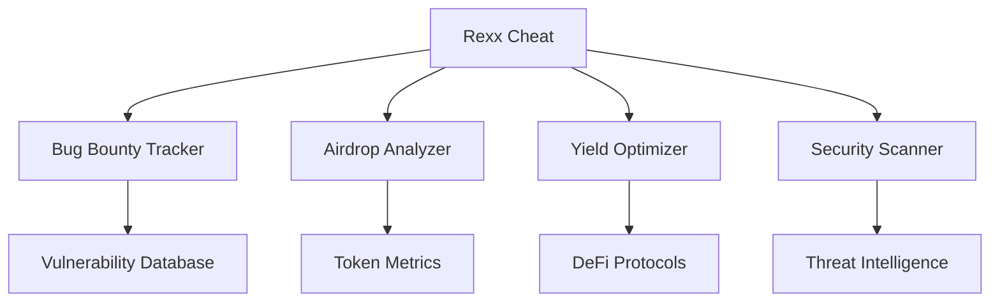

  

<h1 align="center">Rexx Cheat</h1>

<em>Illuminating the Path to Crypto Prosperity</em>

  
  
  
  

## 🚀 About Rexx Cheat

Rexx Cheat stands at the forefront of the crypto revolution, offering an unparalleled platform for enthusiasts, developers, and investors alike. We specialize in curating high-quality information on:

- 🐞 Crypto Bug Bounties
- 🪂 Strategic Airdrops
- 💹 Lucrative Earning Opportunities
- 🔐 Cutting-edge Security Insights

## 🌟 Our Ecosystem

<table>
  <tr>
    <td align="center"><a href="https://github.com/Rexx-Cheat"> <b>GitHub</b></a></td>
    <td align="center"><a href="https://rexxcheat.site/"> <b>Website</b></a></td>
    <td align="center"><a href="https://t.me/RexxCheat"> <b>Channel</b></a></td>
    <td align="center"><a href="https://t.me/RexxLounge"> <b>Lounge</b></a></td>
  </tr>
</table>

## 💡 What Sets Us Apart

- **Real-time Intelligence**: Stay ahead with our lightning-fast updates on emerging opportunities.
- **Community-Driven Insights**: Harness the collective wisdom of our diverse, global network.
- **Rigorous Vetting Process**: We filter the noise, presenting only the most promising prospects.
- **Educational Powerhouse**: From novices to experts, our resources cater to all skill levels.

## 🛠 Featured Tools & Resources

## 🚦 Engagement Roadmap

1. **Explore**: Dive into our [GitHub repositories](https://github.com/Rexx-Cheat) for open-source tools.
2. **Connect**: Join the discussion in our [Telegram Lounge](https://t.me/RexxLounge).
3. **Stay Informed**: Subscribe to real-time alerts on our [Telegram Channel](https://t.me/RexxCheat).
4. **Learn**: Access comprehensive guides and analyses on our [website](https://rexxcheat.site/).

## 🤝 Contribution Guidelines

We thrive on community contributions. Here's how you can make an impact:

- 🔍 Scout for groundbreaking opportunities
- 💻 Contribute to our open-source projects
- 🧠 Share your expertise in our community discussions
- 🛡️ Help maintain the integrity of our ecosystem

## 🔒 Security Commitment

In the ever-evolving crypto landscape, security is paramount. We employ industry-leading practices to safeguard our community:

- 🔐 Multi-layer verification for all shared opportunities
- 🕵️ Continuous monitoring for potential threats
- 🚫 Zero-tolerance policy for scams or misleading information

## 📊 Community Pulse

  
  
  
  

---

  <strong>Empowering the Crypto Vanguard | Securing the Digital Frontier | Unlocking Blockchain Potential</strong>

  <a href="mailto:team@rexxcheat.site">team@rexxcheat.site</a>

